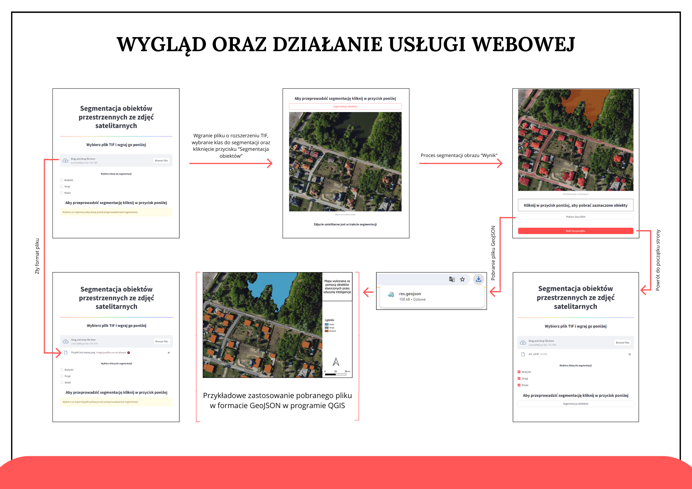

# geospatial_app
Hello humans! Here is my lovely thesis, enjoy! 

A web service based on a convolutional neural network for extracting spatial objects from satellite images has been successfully developed.
Based on various available algorithms using convolutional neural networks, the YOLOv8 network was selected.
The model not only performs classification, detection, but also segmentation of detected objects.
According to users, it is the best network performing segmentation.
The model performs in a really satisfactory way.
The data needed to train the model was collected.
Each satellite image was labeled with objects of three selected classes (buildings, roads, water).
A web service was created to easily and affordably perform real-time segmentation of the objects of the three classes in the satellite images.
The application works very well, and the results of the model segmentation can be downloaded as a GeoJSON file.

 

Instruction

Python Installation
Python version 3.9
https://www.youtube.com/watch?v=96OByGW3jpI

Check the installation
Open the terminal and type
python --version

Creating a virtual environment (Windows)
Create a folder where the virtual environment will be created and the repository will be cloned

In the appropriate folder, type:
python -m venv test_env (name of the virtual environment, e.g., test_env)
.\test_env\Scripts\activate

GitHub Installation (Windows)

Download GitHub according to the instructions in the video
https://www.youtube.com/watch?v=yxpyTliAMAk

You can also check if GitHub is already installed, in which case you should type
git --version

Then clone the repository
git clone https://github.com/ineska01/geospatial_app.git

and go to the directory
cd geospatial_app

Launching the project
.\test_env\Scripts\activate

Check the graphics card
Get-WmiObject win32_VideoController | Format-List Name,
AdapterRAM, DriverVersion

Install the necessary libraries
pip install -r requirements.txt

Running the project
streamlit run main.py

ENJOY :)
